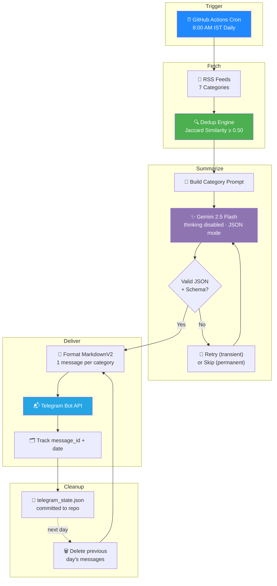

# 📰 News-Bot

**Automated multi-category news digest — fetched, deduplicated, summarized by Gemini, and delivered to Telegram every day at 8:00 AM IST.**


---

## 🧭 Overview

News-Bot is a fully automated news pipeline that pulls from **7 curated RSS categories**, removes near-duplicate stories with Jaccard similarity, summarizes each category into 5 clean headlines via **Gemini 2.5 Flash**, and delivers a formatted digest straight to Telegram — with zero manual intervention, running on a daily **GitHub Actions cron schedule**.

| Category | Description |
|---|---|
| 📌 Technology & Science | Global tech, science breakthroughs |
| 🌍 Geopolitics | International relations, conflicts, diplomacy |
| 💰 Economics | Markets, policy, macroeconomic news |
| 📈 Stock Markets | Equities, IPOs, corporate earnings |
| 🇮🇳 India News & Politics | National news and political developments |
| 🐅 Tamil Nadu Politics | State politics — Tamil-language output, English proper nouns preserved in Roman script |
| 🤖 AI News | AI industry, research, and safety developments |

---

## 🏗️ Architecture



---

## ✨ Features

- **7-category coverage** — technology, geopolitics, economics, markets, India news, Tamil Nadu politics (bilingual), and AI news
- **Smart deduplication** — Jaccard similarity (0.50 threshold) strips near-identical stories before they ever reach the LLM
- **Cost-efficient summarization** — Gemini 2.5 Flash with `thinking_budget=0` and native JSON mode: no wasted reasoning tokens, no markdown-fence parsing needed
- **Resilient retries** — distinguishes transient errors (429 rate limits, 5xx) from permanent ones (bad request, auth) so it never wastes time retrying a failure that can't succeed
- **Schema-validated output** — malformed Gemini responses are filtered, not trusted blindly
- **Clean Telegram delivery** — one MarkdownV2 message per category, headline + summary together
- **Self-cleaning** — every message is tracked and automatically deleted the following day
- **Zero-touch automation** — GitHub Actions cron runs the entire pipeline daily; no server, no manual trigger

---

## 🛠️ Tech Stack

| Tool | Purpose |
|---|---|
|  | Core language |
|  | Summarization engine |
|  | Delivery channel |
|  | Daily scheduler / CI |
|  | Source feeds |

---

## 📂 Project Structure

```
news-bot/
├── fetchers/
│   ├── __init__.py          # fetch_all_categories() aggregator
│   ├── config.py            # category definitions, feed URLs
│   ├── rss_fetcher.py        # RSS parsing
│   ├── tamil_politics.py     # native/fallback routing for TN politics
│   └── dedup.py              # Jaccard similarity deduplication
├── summarizer.py              # Gemini summarization + retry logic
├── telegram_delivery.py       # Telegram send + auto-cleanup
├── main.py                    # pipeline entry point (fetch → summarize → deliver)
├── requirements.txt
├── telegram_state.json        # tracks sent message_ids for next-day cleanup
├── .env.example
├── .gitignore
└── .github/
    └── workflows/
        └── daily-digest.yml   # 8:00 AM IST cron
```

---

## ⚙️ Setup

**1. Clone and install:**
```bash
git clone https://github.com/ajeemsuban060-glitch/news-bot.git
cd news-bot
pip install -r requirements.txt
```

**2. Configure environment** — copy `.env.example` to `.env` and fill in:
```
GEMINI_API_KEY=your_gemini_api_key
TELEGRAM_BOT_TOKEN=your_bot_token
TELEGRAM_CHAT_ID=your_chat_id
```

**3. Run locally:**
```bash
python main.py
```

**4. Enable automation** — add the same three values as **repository secrets** (Settings → Secrets and variables → Actions), then the workflow in `.github/workflows/daily-digest.yml` runs automatically every day at 8:00 AM IST. Trigger it manually anytime from the **Actions** tab via `workflow_dispatch`.

---

## 🔒 Security

- `.env` is git-ignored — never committed
- Secrets live only in GitHub Actions repository secrets
- If a token is ever exposed, rotate it immediately via BotFather (Telegram) or Google AI Studio (Gemini)

---

## 📜 License

MIT — see [LICENSE](LICENSE) for details.
